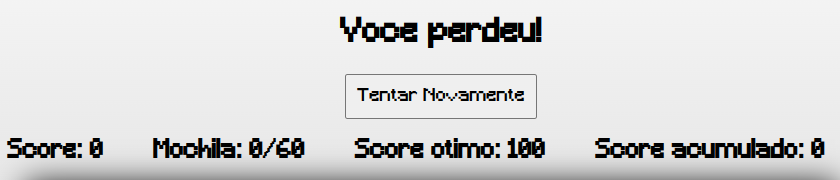

# Labirinto Do Hoglin

**Número da Lista**: 20 
**Conteúdo da Disciplina**: Greed 

## Alunos
|Matrícula | Aluno |
| -- | -- |
| 19/0025379  |  Brenno Oliveira Silva |
| 19/0020377  |  Thiago Sampaio de Paiva |

## Sobre 
O labirinto do Hoglin dessa entrega consiste numa evolução do trabalho de [Grafos2](https://github.com/projeto-de-algoritmos/Grafos2_LabirintoDoHoglin), adicionando um modo que o jogador deve passar pelas fases avaliando o peso e valor das estrelas buscando a melhor pontuação calculado por um algoritmo de knapsack.

## Screenshots

## Apresentação
[Video da Apresentação](assets/videos/apresentacao.mp4)

## Demonstração

## Instalação 
**Linguagem**: Javascript 
**Pré-requisitos**: Navegador Web

## Uso 
Para utilizar o projeto acesse: https://labirinto-hoglin-greed.herokuapp.com/ ou abra o arquivo ´index.html´ no navegador web de sua preferência

